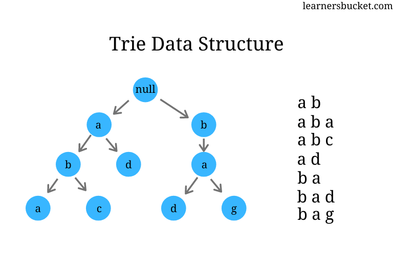

# Trie

A Trie is a tree-like data structure used to store strings by breaking them into characters and placing each character in a node along a path from the root.

## What consists a Trie

A Trie is typically made of:

- A root node that represents the starting point of all words.
- Child links from each node to the next possible character.
- A flag on each node that marks whether the path up to that node forms a complete word.

For example, if you insert `"cat"` and `"car"`, both words share the path `c -> a`, and then split into `t` and `r`.

## Use Cases

A Trie is useful when you need fast prefix-based string operations, especially across many words.

Common use cases:

- Autocomplete and search suggestions.
- Dictionary word lookup.
- Prefix matching.
- Spell checking.
- IP routing and longest-prefix matching.

It is most valuable when many strings share common prefixes, because those prefixes can be stored once and reused.

## Pros And Cons

### Pros

- Fast lookup for words and prefixes.
- Efficient for prefix-heavy datasets.
- Natural fit for autocomplete and dictionary-style problems.
- Can support operations like listing all words with a prefix.

### Cons

- Higher memory usage than simpler structures like arrays or hash sets.
- More complex to implement and maintain than basic maps.
- Can be inefficient when stored strings do not share many prefixes.
- Performance depends on how children are represented, for example arrays vs maps.
